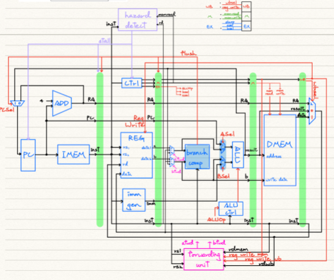

# CSCS10014: Computer Organization class lab homework

diary: [diary of computer organization](https://hackmd.io/cuwvQXPuQt6DtWr_r6M5yw)
&emsp;
## lab0 : fulladder and ALU
the code is not throughly checked
&emsp;
## lab1, 2: Single cycle CPU 
the implementation of RICS-V Single cycle CPU refers to the following structures 


## lab 3, 4: Pipeline CPU



## lab 5: Cache
Reaching the best performance with 3-way 8-block len
please refers to CacheManager.cpp
&emsp;
Note1 : using gtkwave command 
```
uset GTK_PATH   # you may need it when using vscode
gtkwave waveform.vcd 
```

Note2 : using TEST_INSTRUCTIONS.txt
we need to ensure the last line of txt is blank