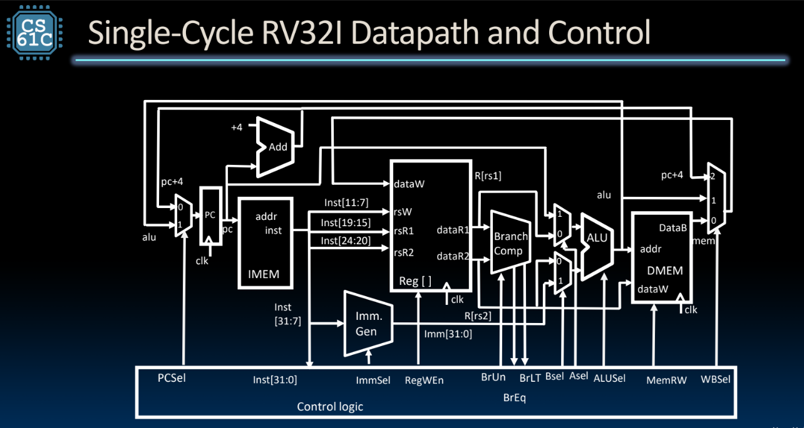
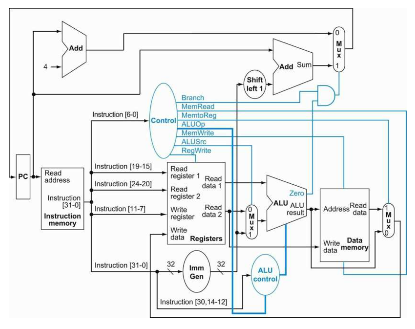

# CSCS10014: Computer Organization class lab homework

dairy : [diary of computer organization](https://hackmd.io/cuwvQXPuQt6DtWr_r6M5yw)

## lab1, 2 : Single cycle CPU 
[hw link](https://nycu-caslab.github.io/CO2024/labs/Lab%202.html)
the implemetation of RICS-V Single cycle cpu refers to the following structures 

